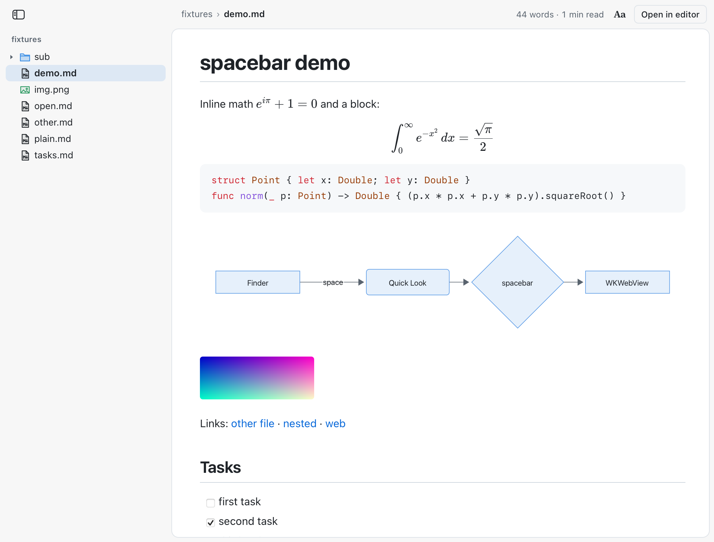

# spacebar

Press Space on a Markdown file in Finder and read it properly: headings, tables, task lists, code highlighting, math and
Mermaid diagrams, in six themes. The sidebar is a file browser for the folder: its subfolders open in place, and a click shows
any file in the panel, so you can read the Markdown, images, PDFs, code, JSON and CSV beside a document without leaving Quick
Look. Drag its edge to resize it; its button collapses it, and every preview remembers both. Click a block of Markdown to edit
it in place, or tick a task box, and the file is saved. Obsidian vaults read as they do in Obsidian: `[[wikilinks]]`,
`![[embeds]]`, callouts and tags. Free and open source, for macOS 13 and later (Apple silicon and Intel).

What the panel shows for each file in the sidebar:

| File | Shown as |
|---|---|
| Markdown (`.md`, `.markdown`, `.mdown`, `.mkd`, `.mkdn`) | rendered, with inline editing and task toggles |
| Images (`.png`, `.jpg`, `.gif`, `.webp`, `.heic`, `.avif`, `.bmp`, `.tiff`, `.ico`, `.svg`) | fitted to the panel, with its dimensions and size; SVG as an image only |
| PDF | drawn natively by PDFKit in the panel, fitted to its width, pages in one scroll |
| Code and config (`.js`, `.ts`, `.tsx`, `.py`, `.rb`, `.go`, `.rs`, `.swift`, `.sh`, `.c`, `.java`, `.kt`, `.css`, `.html`, `.xml`, `.yaml`, `.toml`, `.sql`, `Dockerfile`, `Makefile` and more) | highlighted source with line numbers; HTML is shown as source, never rendered |
| JSON | pretty-printed and highlighted, with a Raw toggle |
| CSV and TSV | a table, first row as the header, up to 1,000 rows |
| Text (`.txt`, `.log`, `LICENSE`, `.env.example` and other text) | as is, with line numbers |
| Anything else | an info card: kind, size, date modified, and Open with its default app (Reveal in Finder for apps, scripts and executables) |

Text over 2 MB shows its first 2 MB. Images over 50 MB get the info card.

The preview sits in a thin outlined page under a toolbar row: the sidebar button and the path on the left, Aa and Open on the
right. **Minimal chrome** (Settings, Appearance) goes back to floating buttons over the page.

### Folders and Obsidian vaults

Turn on **Preview folders** (Settings, Folders) and press Space on any folder. It opens on:

1. its README;
2. else its first Markdown file;
3. else the Markdown file a quick look through its subfolders finds: the nearest the top, then one named like `index` or
   `Home`, then the newest. It looks at most 3 folders deep and 5,000 items, for at most a quarter of a second, and never inside
   hidden folders, `node_modules` or packages;
4. else an overview of the folder: how many folders, notes, images, PDFs and other files it holds, and the files changed most
   recently, each a click away.

App bundles and other packages, the top of a volume and system folders (`/System`, `/Library`, `/usr` and the like, and
`~/Library`) keep Quick Look's usual preview. Click the folder's name at the top of the sidebar to see its overview again.

In a vault (a folder with `.obsidian` in it), and in any other folder:

- `[[Note]]`, `[[Note|alias]]`, `[[folder/Note]]` and `[[Note#Heading]]` open that note in the panel. A name is looked for
  anywhere under the folder the sidebar shows; a link that matches nothing is greyed out.
- `![[image.png]]` (`![[image.png|300]]` for a width) shows the image; `![[Note]]` shows the note inline, read only, one level
  deep.
- `> [!note] Title` callouts (note, tip, warning, danger, example, quote and the rest) are drawn as boxes, and `#tags` as pills.
- A note you press Space on inside a vault shows the whole vault in the sidebar, so its links reach every note.
- `.obsidian` is hidden, like every hidden file, unless you turn hidden files on.

[spacebar.patebryant.com](https://spacebar.patebryant.com)

<picture>
  <source media="(prefers-color-scheme: dark)" srcset="docs/evidence/themes/theme-github-dark.png">
  
</picture>

## Install

```sh
curl -fsSL https://spacebar.patebryant.com/install.sh | sh
```

Then select a `.md` file in Finder and press Space.

spacebar is **not notarized**: there is no Apple Developer ID behind it yet. Use the install command; a browser download
of the zip will be blocked by Gatekeeper. Files that curl downloads are not quarantined, so Gatekeeper does not stop the app,
but it also means you are trusting this repository's build rather than Apple's check.
Read [`scripts/install.sh`](scripts/install.sh) before you run it. It:

1. checks for macOS 13 or later;
2. downloads `spacebar.zip` and `spacebar.zip.sha256` from the latest release (or `SPACEBAR_VERSION=vX.Y.Z`) through
   `github.com/patebry/spacebar/releases/latest/download/`, with no GitHub API calls, and stops unless the SHA-256 matches;
3. copies the new app into `~/Applications` beside the old one (no `sudo`);
4. if `~/Applications/spacebar.app` exists, quits it and unregisters its extensions, moves it aside, moves the new copy
   into its place and only then deletes the old one (it is put back if the move fails). Nothing else is deleted;
5. registers it with `lsregister` and `pluginkit`, turns the Markdown preview on, and resets Quick Look (`qlmanage -r`);
6. lists other Quick Look extensions that are turned on and also claim Markdown, such as QLMarkdown, says how to turn them
   off, and warns if another copy of spacebar is in `/Applications`. It never turns off or deletes anything itself.

`install.sh --help` lists its options, including `--dry-run`, which downloads and verifies but changes nothing.

The release zip is built by [GitHub Actions](.github/workflows/release.yml) from the tagged commit. Releases after v0.1.0
are signed with a self-signed "spacebar Release" certificate, so every release has the same signer and an update does not
make macOS ask again about the extension's data ([why](FINDINGS.md#release-signing)). v0.1.0 was ad-hoc signed, so the first
update from it may show one prompt. Those releases also carry a build provenance attestation, which the
[GitHub CLI](https://cli.github.com) checks:

```sh
gh attestation verify spacebar.zip -R patebry/spacebar
```

## Uninstall

```sh
curl -fsSL https://raw.githubusercontent.com/patebry/spacebar/main/scripts/uninstall.sh | sh
```

This unregisters and deletes `~/Applications/spacebar.app`. To also delete your settings and themes in
`~/Library/Application Support/spacebar`:

```sh
curl -fsSL https://raw.githubusercontent.com/patebry/spacebar/main/scripts/uninstall.sh | sh -s -- --purge
```

## Build from source

Requirements: macOS 13+ and the Xcode command-line tools (`xcode-select --install`); the full Xcode app is not needed.

```sh
git clone https://github.com/patebry/spacebar.git
cd spacebar
./build.sh              # build, sign, install to ~/Applications and register
./build.sh --no-install # build into build/spacebar.app only
```

`build.sh` signs with the identity named in an untracked `.sign-id` file, else the first code-signing identity in your
keychain, else ad-hoc (`SIGN_ID=-` forces ad-hoc). A stable identity keeps macOS from asking again about the extension's
sandbox container after each rebuild. Other options are documented at the top of the script.

Tests that run off screen, without Quick Look (the test builds target Apple silicon):

```sh
for t in settings scheme linkpolicy cas editkeys pdfpane; do test/$t/run.sh; done
python3 test/webcheck.py && python3 test/webthemes.py && python3 test/remoteimages.py && python3 test/sidebar.py
```

The other scripts in `test/` drive real Quick Look windows and synthetic input; run them on a machine you are not using.

## How it works

```
spacebar.app                         settings window (SwiftUI)
└─ PlugIns/SpacebarPreview.appex     sandboxed Quick Look preview: WKWebView + markdown-it, KaTeX, highlight.js,
   │                                 Mermaid, DOMPurify, all bundled; no network code of its own
   └─ XPCServices/…writer.xpc        small unsandboxed helper: saves edits, opens links, owns the inline-edit panel
└─ PlugIns/SpacebarFolders.appex     the same preview for folders (off unless you enable folder previews)
```

Quick Look extensions never receive key events, so inline editing uses a click-through, non-activating panel owned by the
writer service; Finder stays in front. Saves are compare-and-swap: if the file changed on disk, the external change wins.
[FINDINGS.md](FINDINGS.md) has the details and measurements.

## Privacy and security

- No analytics, telemetry, accounts or update checks. Settings are a JSON file in `~/Library/Application Support/spacebar`.
- Remote images are off by default (fetching one tells its server when you opened the document). A blocked image offers a
  one-time load for that document.
- A Markdown file is treated as hostile. The page runs under a strict Content Security Policy (bundled scripts only, no
  inline scripts, frames, forms or connections), and DOMPurify sanitizes everything before it reaches the page.
- The writer only writes to the Markdown file on screen, only opens http(s) links or non-executable documents, and only
  accepts messages from the extension's own page. Apps, scripts and executables in the sidebar can only be revealed in Finder.
- The file browser never leaves the previewed folder: links that lead out of it are not listed, a file or folder the page asks
  for must be one the sidebar listed and must still resolve inside the folder, and hidden files are left out unless you turn
  them on. A wikilink or embed resolves only to a file found inside the folder the sidebar shows; `..`, absolute paths and links
  that lead out of it resolve to nothing. Nothing in a file is ever run: HTML and scripts are shown as source, SVG only as an
  image, a PDF by PDFKit (which runs no PDF scripts; the PDF is parsed in the sandboxed preview extension itself), and the page
  loads files only as images.
- The preview extension has a read-only sandbox exception for the whole disk, so relative images beside a document load and
  the sidebar can show the folder's files.
- The preview extension has the `com.apple.security.network.client` entitlement. WKWebView's helper processes crash-loop
  in a sandboxed extension without it. spacebar has no network code of its own; the only requests the page can make are
  remote images, which are blocked unless you allow them.

Found a security problem? Please report it privately as described in [SECURITY.md](SECURITY.md), not in a public issue.

## Contributing

Issues and pull requests are welcome. Please run the off-screen tests above before sending a change, and keep new
dependencies out of the extension unless they are vendored with their licence (see `Preview/web/vendor/VERSIONS.txt` and
[THIRD_PARTY_NOTICES.md](THIRD_PARTY_NOTICES.md)).

## Licence

MIT, © 2026 Pate Bryant. See [LICENSE](LICENSE). Bundled third-party code and fonts keep their own licences, listed in
[THIRD_PARTY_NOTICES.md](THIRD_PARTY_NOTICES.md).

Not affiliated with Apple. Mac, macOS, Finder and Quick Look are trademarks of Apple Inc.
