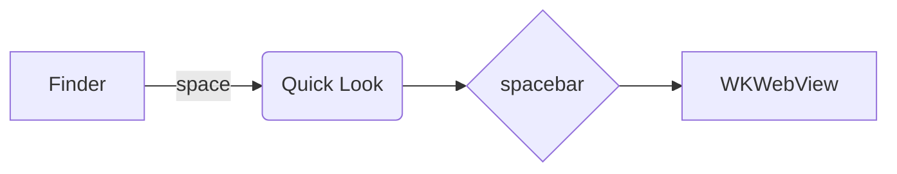

# spacebar demo

Inline math $e^{i\pi} + 1 = 0$ and a block:

$$
\int_0^\infty e^{-x^2}\,dx = \frac{\sqrt{\pi}}{2}
$$

```swift
struct Point { let x: Double; let y: Double }
func norm(_ p: Point) -> Double { (p.x * p.x + p.y * p.y).squareRoot() }
```




Links: [other file](./other.md) · [nested](sub/nested.md) · [web](https://example.com)

## Tasks

- [ ] first task
- [x] second task
- [ ] third task
