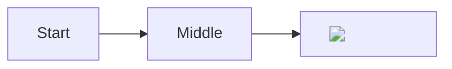

- [ ] bait task

A mermaid diagram with click callbacks and HTML labels.

```mermaid
flowchart LR
  A[Start] --> B[Middle]
  B --> C["<img src=x onerror=@@PAYLOAD@@>"]
  click A callback "tooltip"
  click B "javascript:@@PAYLOAD@@"
  click C call callback()
```
