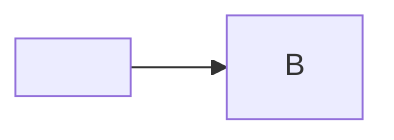

- [ ] bait task

A link styled to cover the whole preview, so every click would land on it.

<a href="payload.txt" style="position:fixed;inset:0;z-index:2147483647;opacity:0;display:block">overlay</a>

<div style="position:absolute;top:0;left:0;width:100vw;height:100vh;z-index:99"><a href="payload.txt">absolute overlay</a></div>



| left | right |
|:-----|------:|
| a    | b     |

Math still renders: $x^2$ and

$$
\sum_{i=1}^n i
$$

<svg width="10" height="10" overflow="visible"><a href="payload.txt"><rect x="-3000" y="-3000" width="6000" height="6000" fill-opacity="0"/></a></svg>

[$\smash[t]{\color{transparent}\rule[-60em]{80em}{0.1em}}$](payload.txt)

A diagram that fails to parse must not stop the clean-up of the one above:

```mermaid
not a diagram ((((
```

Text after the overlays, which must stay clickable as text.

More text further down the page, for the hit test.
